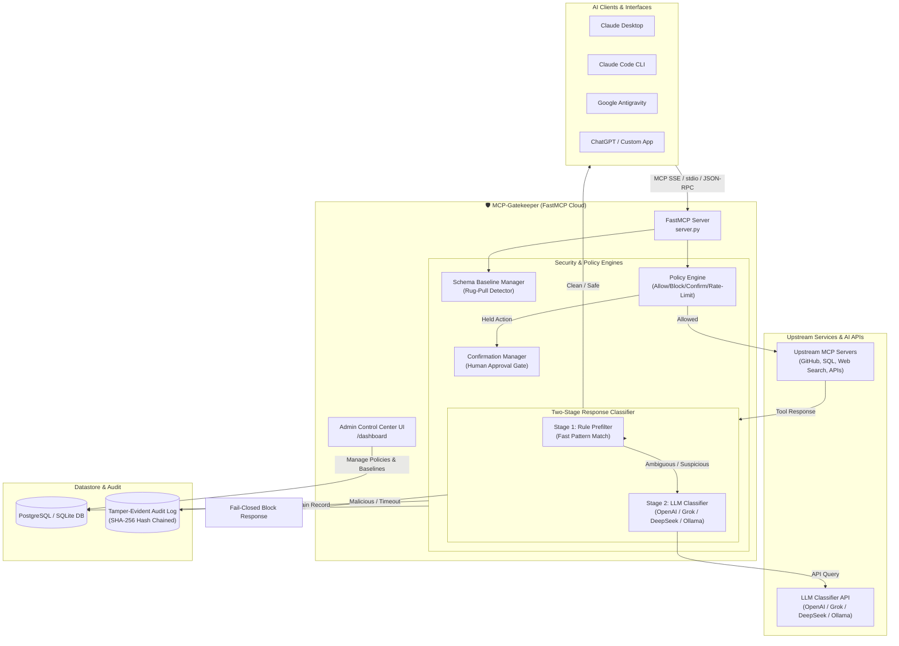
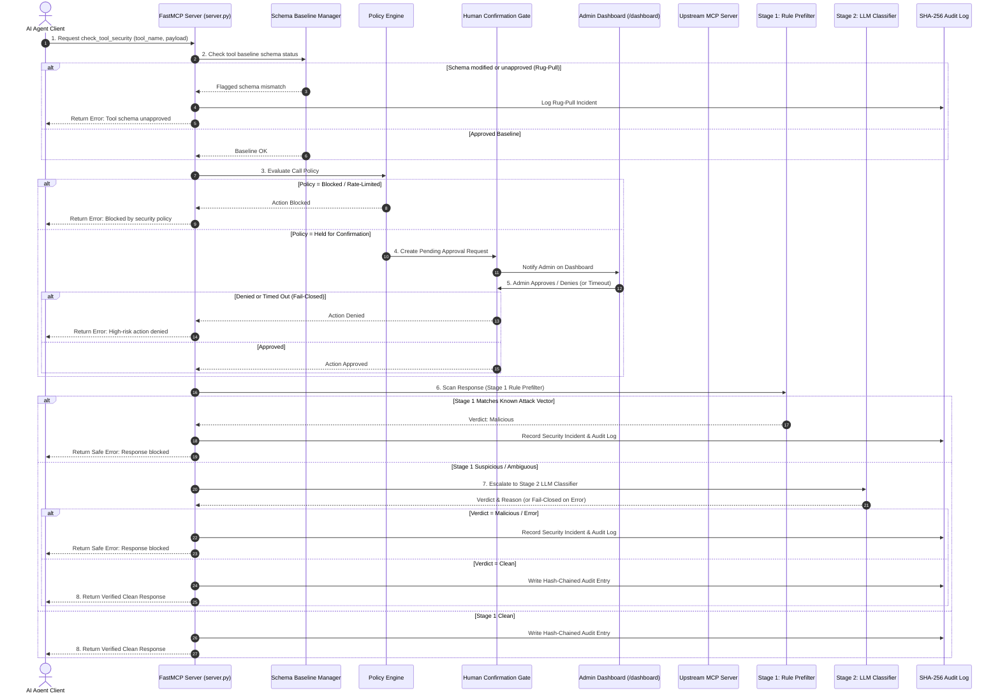

# 🛡️ MCP-Gatekeeper

> **Runtime Security Gateway & FastMCP Server for Model Context Protocol (MCP) Clients and Upstream Servers.**

MCP-Gatekeeper is a defense-in-depth proxy and FastMCP server that inspects **100% of tool-list refreshes and tool responses**, preventing tool poisoning, response-borne prompt injection (e.g. MCPoison / CurXecute attacks), silent tool schema modification ("rug pulls"), and unauthorized high-risk operations.

Designed for instant deployment to **[fastmcp.cloud](https://fastmcp.cloud)** or local execution via `fastmcp` CLI.

---

## 🚀 Key Features & Capabilities

1. **FastMCP Cloud Ready**: Single-file FastMCP entry point (`server.py`) deployable directly to **fastmcp.cloud** with SSE and HTTP transport.
2. **Rug-Pull Schema Protection**: Connect-time tool schema baseline capture; diffs 100% of tool-list refreshes against approved baselines and blocks unapproved tool changes by default.
3. **Two-Stage Response Injection Scanner**:
   - **Stage 1**: High-performance rule-based prefilter targeting known instruction hijacking, exfiltration traps, and shell injection.
   - **Stage 2**: Deep semantic LLM classification utilizing any OpenAI-compatible API (`LLM_API_KEY` from `.env`, supporting OpenAI, Grok, DeepSeek, Anthropic, or local Ollama).
4. **Fail-Closed Security Design**: Any classifier failure, network timeout, or unhandled exception defaults to **blocking the payload** and creating a security incident.
5. **Policy Engine**: Per-tool and per-server configurable rule evaluation (`allow`, `block`, `confirm`, `rate_limit`).
6. **Human Confirmation Gate**: Holds high-risk actions pending admin approval; fails closed (denies) if unanswered within configurable timeout.
7. **Tamper-Evident Audit Trail**: Every call, response, policy verdict, and admin decision is stored with **SHA-256 hash chaining**.
8. **Cloud Control Center Dashboard**: Live HTML Admin Dashboard served directly via FastMCP at `/dashboard`.

---

## 🛠️ Architecture Overview

### High-Level System Architecture



---

### Detailed Execution Flow & Security Pipeline



---

## 🔑 Environment Configuration (`.env`)

The gateway reads generic LLM environment configuration from `.env`:

```env
# LLM Security Classifier API Key (Supports OpenAI, DeepSeek, Grok, Ollama)
LLM_API_KEY="your-llm-api-key-here"
LLM_API_URL="https://api.openai.com/v1/chat/completions" # or https://api.x.ai/v1/chat/completions, https://api.deepseek.com/v1/chat/completions
LLM_MODEL="gpt-4o-mini" # or grok-2-latest, deepseek-chat, llama3, etc.

ADMIN_API_KEY="trust-gateway-admin-key-secret"
DATABASE_URL="sqlite+aiosqlite:///mcp_trust_gateway.db"
FAIL_CLOSED=true
CLASSIFIER_TIMEOUT_SECONDS=3.0
CONFIRMATION_TIMEOUT_SECONDS=60
```

---

## ☁️ Deployment & Client Integration

### 1. Deploying to FastMCP Cloud

1. Push this repository to GitHub.
2. Go to **[fastmcp.cloud](https://fastmcp.cloud)** and create a new server:
   - **Entry Point**: `server.py`
   - **Environment Variable**: `LLM_API_KEY` = `your-api-key-here`
3. Click **Deploy**. FastMCP Cloud provides your endpoints:
   - **MCP SSE Server**: `https://mcp.fastmcp.cloud/your-username/mcp-trust-gateway/sse`
   - **Admin Dashboard**: `https://mcp.fastmcp.cloud/your-username/mcp-trust-gateway/dashboard`

---

### 2. Client Configurations

#### 🤖 Google Antigravity & Claude Desktop (`mcp_config.json`)
```json
{
  "mcpServers": {
    "mcp-trust-gateway": {
      "url": "https://mcp.fastmcp.cloud/your-username/mcp-trust-gateway/sse"
    }
  }
}
```

#### 💻 Claude Code (CLI)
```bash
claude mcp add mcp-trust-gateway --transport sse \
  https://mcp.fastmcp.cloud/your-username/mcp-trust-gateway/sse
```

---

## 🧪 Testing & Adversarial Regression Suite

Run the full pytest suite including the **Adversarial Regression Test Suite**:

```bash
pytest -v
```

### Metrics Achieved
- 📊 **Adversarial Catch Rate**: **100%** (Target: ≥95%)
- 📊 **False Positive Rate**: **0%** (Target: <2%)

---

## 📝 Design Decisions

1. **Fail-Closed Default**: All ambiguous responses, classifier timeouts, network issues, or unapproved schema modifications fail closed (block action and alert admins).
2. **Credential Redaction**: Secrets, API tokens, and passwords matching sensitive keys are automatically redacted before saving to audit storage.
3. **Stage 1 Fast Filter + LLM Escalation**: Known malicious patterns are intercepted immediately by Stage 1, eliminating latency and API overhead for obvious attacks while leveraging an LLM for complex semantic analysis.
4. **Tamper-Evident Hash Chaining**: Every log entry computes `SHA256(actor | action | target | details | prev_hash | timestamp)` ensuring non-repudiation and detection of log tampering.
