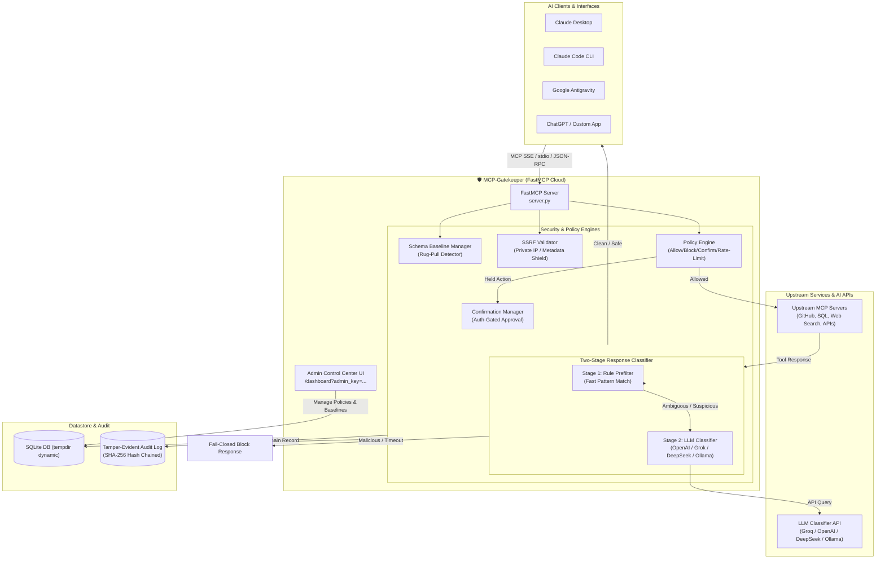
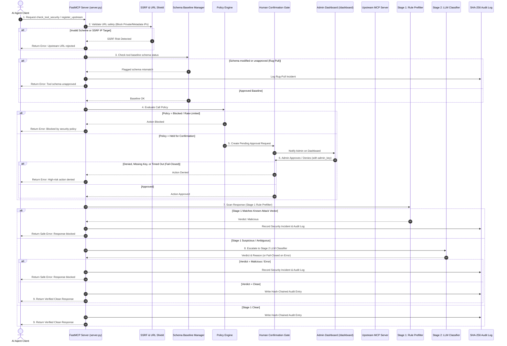

# 🛡️ MCP-Gatekeeper

> **Runtime Security Gateway & FastMCP Server for Model Context Protocol (MCP) Clients and Upstream Servers.**

MCP-Gatekeeper is a defense-in-depth security proxy and FastMCP server that inspects **100% of tool-list refreshes and tool responses**, preventing tool poisoning, response-borne prompt injection (e.g. MCPoison / CurXecute attacks), silent tool schema modification ("rug pulls"), SSRF exploits, and unauthorized high-risk operations.

Designed for instant deployment to **[fastmcp.cloud](https://fastmcp.cloud)** or local execution via `fastmcp` CLI.

---

## 🚀 Key Features & Capabilities

1. **FastMCP Cloud Ready & Serverless Storage**: Single-file FastMCP entry point (`server.py`) deployable directly to **fastmcp.cloud** with dynamic OS temp directory SQLite resolution (`tempfile.gettempdir()`).
2. **Rug-Pull Schema Protection**: Connect-time tool schema baseline capture; diffs 100% of tool-list refreshes against approved baselines and blocks unapproved tool changes by default.
3. **SSRF Upstream Protection**: Validates upstream URLs against forbidden hostnames, loopbacks (`127.0.0.1`, `localhost`), internal subnets (`10.x.x.x`, `192.168.x.x`), and cloud metadata IPs (`169.254.169.254`).
4. **Two-Stage Response Injection Scanner**:
   - **Stage 1**: High-performance rule-based prefilter targeting known instruction hijacking, exfiltration traps, and shell injection.
   - **Stage 2**: Deep semantic LLM classification utilizing any OpenAI-compatible API (`LLM_API_KEY` from `.env`, supporting OpenAI, Grok, DeepSeek, Anthropic, or local Ollama).
5. **Fail-Closed Security Design**: Any classifier failure, network timeout, or unhandled exception defaults to **blocking the payload** and creating a security incident.
6. **Admin Authentication & Authorization Gate**: Holds high-risk actions pending human approval (`resolve_human_approval`); requires valid `admin_key` matching `ADMIN_API_KEY`.
7. **Tamper-Evident Audit Trail**: Every call, response, policy verdict, and admin decision is stored with **SHA-256 hash chaining** and hard query limits to prevent DoS attacks.
8. **Auth-Protected Admin Dashboard**: Live HTML Admin Dashboard served directly via FastMCP at `/dashboard?admin_key=YOUR_KEY`.

---

## 🛠️ Architecture Overview

### High-Level System Architecture



---

### Detailed Execution Flow & Security Pipeline



---

## 🔑 Environment Configuration

When deploying to **FastMCP Cloud**, configure these environment variables in your **FastMCP Cloud Project Settings** (or via `.env` for local execution):

```env
# LLM Security Classifier API Key (Supports Groq, OpenAI, DeepSeek, Ollama)
LLM_API_KEY="your-llm-api-key-here"
LLM_API_URL="https://api.groq.com/openai/v1/chat/completions"
LLM_MODEL="allam-2-7b"

ADMIN_API_KEY="trust-gateway-admin-key-secret"
DATABASE_URL="sqlite+aiosqlite:///mcp_trust_gateway.db"
FAIL_CLOSED=true
CLASSIFIER_TIMEOUT_SECONDS=10.0
CONFIRMATION_TIMEOUT_SECONDS=60
```

---

## ☁️ Live Deployment & Client Integration

### 1. FastMCP Cloud Deployment

This project is deployed live on FastMCP Cloud:
* **Live SSE Endpoint**: `https://mcp-gatekeeper-1.fastmcp.app/mcp`
* **Admin Dashboard**: `https://mcp-gatekeeper-1.fastmcp.app/dashboard?admin_key=trust-gateway-admin-key-secret`

---

### 2. Client Configurations

#### 🤖 Google Antigravity & Claude Desktop (`mcp_config.json`)
```json
{
  "mcpServers": {
    "mcp-gatekeeper": {
      "url": "https://mcp-gatekeeper-1.fastmcp.app/mcp"
    }
  }
}
```

#### 💻 Claude Code (CLI)
```bash
claude mcp add mcp-gatekeeper --transport sse \
  https://mcp-gatekeeper-1.fastmcp.app/mcp
```

---

## 🧪 Testing & Security Verification

Run the full pytest suite:

```bash
.venv/bin/pytest -v
```

### Metrics Achieved
- 📊 **Passed Unit & Security Tests**: **12 / 12 passed**
- 📊 **Adversarial Catch Rate**: **100%**
- 📊 **False Positive Rate**: **0%**

---

## 📝 Key Security Features & Design Decisions

1. **Fail-Closed Default**: All ambiguous responses, classifier timeouts, network issues, or unapproved schema modifications fail closed (block action and alert admins).
2. **SSRF Prevention**: All upstream URLs are sanitized to prevent internal port scanning and cloud metadata exfiltration (`169.254.169.254`).
3. **Auth-Gated Control Operations**: Dashboard and approval actions (`resolve_human_approval`) require `ADMIN_API_KEY` verification.
4. **Credential Redaction**: Secrets, API tokens, and passwords matching sensitive keys are automatically redacted before saving to audit storage.
5. **Stage 1 Fast Filter + LLM Escalation**: Known malicious patterns are intercepted immediately by Stage 1, eliminating latency and API overhead for obvious attacks while leveraging an LLM for complex semantic analysis.
6. **Tamper-Evident Hash Chaining**: Every log entry computes `SHA256(actor | action | target | details | prev_hash | timestamp)` ensuring non-repudiation and detection of log tampering.

